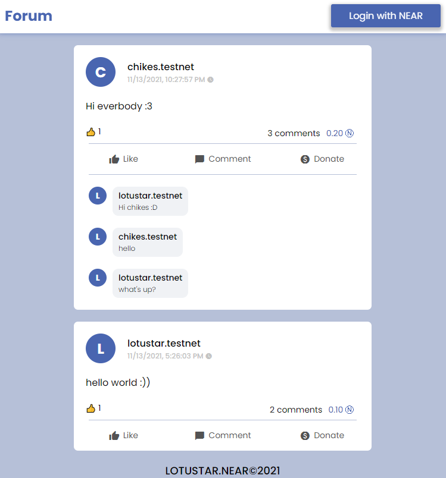

NEARForum - a blockchain web 3 application based on NEAR platform
==================
OVERVIEW
======

NEARForum is a social networking project on a decentralized platform. Everyone can create posts, comment, like or donate like normal social networks.

 - The contract code lives in the `/contract/assembly` folder.
 - The web app made by ReactJS framework

The demo from challenge Dacade courses "NEAR Development 101": [https://dacade.org/communities/near/courses/near-101/]

 - [Demo Website.]
 - You can signup here to learn and earn crypto: https://dacade.org/signup?invite=lotustar

TECHNOLOGY
======

 - `ReactJS`
 - `Near SDK (near-sdk-as)`

SCREEN
======

INSTALL
======

1. Prerequisites: Make sure you have Node.js ≥ 12 installed (https://nodejs.org), then use it to install [yarn]: npm install --global yarn (or just npm i -g yarn)
2. Run the local development server: yarn && yarn dev (see package.json for a full list of scripts you can run with yarn)

BUILD & DEPLOY
======

Every smart contract in NEAR has its [own associated account][NEAR accounts]. When you run `yarn dev`, your smart contract gets deployed to the live NEAR TestNet with a throwaway account. When you're ready to make it permanent, here's how.

Step 0: Install near-cli (optional)
-------------------------------------

[near-cli] is a command line interface (CLI) for interacting with the NEAR blockchain. It was installed to the local `node_modules` folder when you ran `yarn install`, but for best ergonomics you may want to install it globally:

    yarn install --global near-cli

Or, if you'd rather use the locally-installed version, you can prefix all `near` commands with `npx`

Ensure that it's installed with `near --version` (or `npx near --version`)

Step 1: Create an account for the contract
------------------------------------------

Each account on NEAR can have at most one contract deployed to it. If you've already created an account such as `your-name.testnet`, you can deploy your contract to `nearforum.your-name.testnet`. Assuming you've already created an account on [NEAR Wallet], here's how to create `nearforum.your-name.testnet`:

1. Authorize NEAR CLI, following the commands it gives you:

      near login

2. Create a subaccount (replace `YOUR-NAME` below with your actual account name):

      near create-account nearforum.YOUR-NAME.testnet --masterAccount YOUR-NAME.testnet

Step 2: set contract name in code
---------------------------------

Modify the line in `src/config.js` that sets the account name of the contract. Set it to the account id you used above.

    const CONTRACT_NAME = process.env.CONTRACT_NAME || 'nearforum.YOUR-NAME.testnet'

IMPOTANT: If you deploy contract to testnet server (accountId be like xxx.testnet), you should remove `process.env.NODE_ENV` at `src/utils.js`:

    const nearConfig = getConfig("development");

because When you run `npm start`, `process.env.NODE_ENV` is always equal to 'development', when you run `npm test` it is always equal to 'test', and when you run `npm run build` to make a production bundle, it is always equal to 'production'. So if `nearConfig` is production config, all url are mainnet server, not testnet server that you deployed your contract! You maybe get this error:
`https://stackoverflow.com/questions/69952774/reactjs-not-call-method-from-smart-contract-near-on-product-testnet-does-not`

Step 3: deploy!
---------------

One command:

    yarn deploy

As you can see in `package.json`, this does two things:

1. builds & deploys smart contract to NEAR TestNet
2. builds & deploys frontend code to GitHub using [gh-pages]. This will only work if the project already has a repository set up on GitHub. Feel free to modify the `deploy` script in `package.json` to deploy elsewhere.

  [React]: https://reactjs.org/
  [create-near-app]: https://github.com/near/create-near-app
  [Node.js]: https://nodejs.org/en/download/package-manager/
  [jest]: https://jestjs.io/
  [NEAR accounts]: https://docs.near.org/docs/concepts/account
  [NEAR Wallet]: https://wallet.testnet.near.org/
  [near-cli]: https://github.com/near/near-cli
  [gh-pages]: https://github.com/tschaub/gh-pages
  [Demo Website.]: https://namnp1521.github.io/NEARForum/
